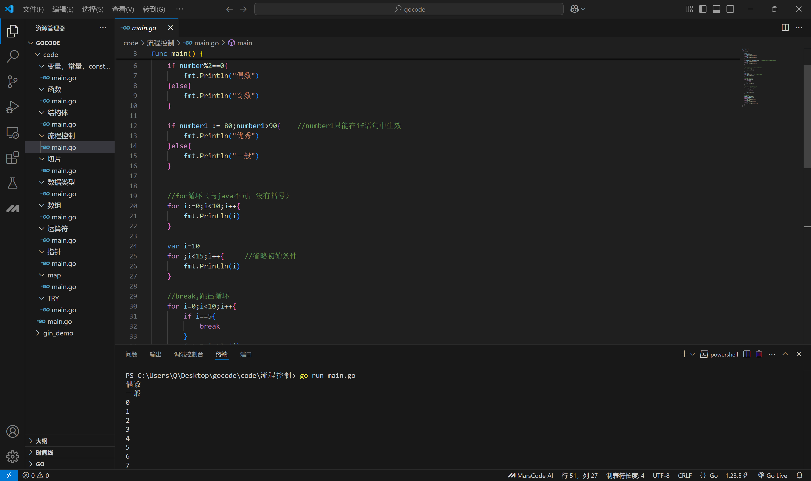
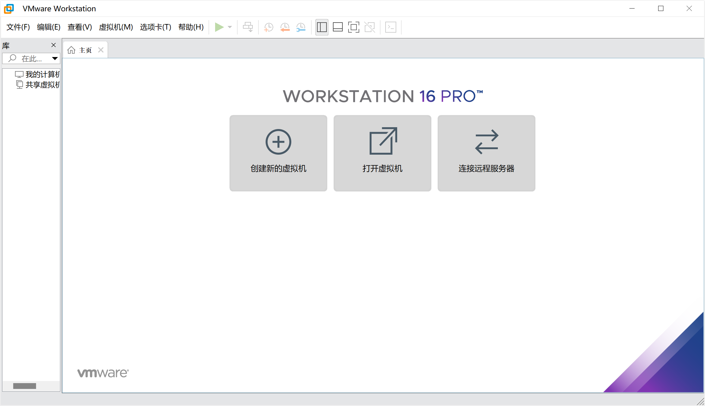
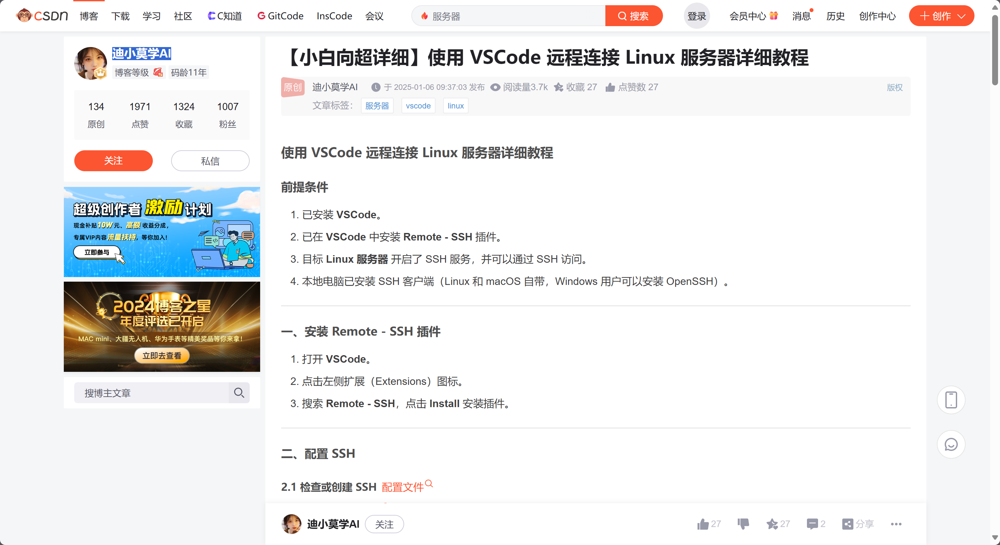
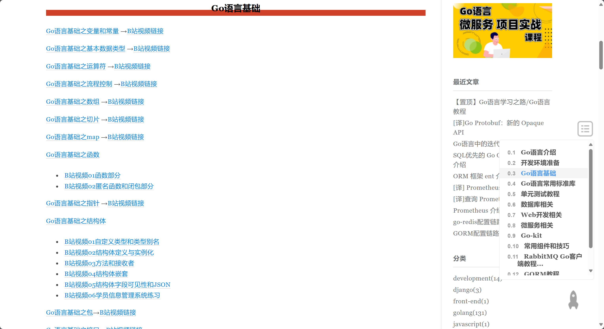

# 后端1.0
> 主要为golang的相关内容

## 学习目录
- go的特性、应用
- go开发环境的搭建
- go的基础语法

## 学习内容

### go的特性、应用
   - 高性能
   - 高并发
   - 语法简单
   - 跨平台
   - 服务器端开发
   - 等
  
### go开发环境的搭建
   一开始并没有按照要有上面的内容去学习搭建，而是直接使用VScode，安装相关插件，go run main.go，直接使用
   
   （用着就习惯了，最近才突然想起来要搭建环境）查资料后发现需要使用VMware安装go的环境，同学正好有这方面的资料，目前还在捣鼓
   

### go的基础语法
(感觉与Java有很多相似之处，类似于面向对象，特别是结构体等)
- 注释： 
  - 单行注释：//
  - 多行注释：/* */
- 数据类型：
  - 布尔型：bool
  - 数字型：int、float、complex
  - 字符串型：string
- 类型转换：
  - 类型转换：T(v)
- 变量与常量：
  - 变量的初始化：var a int = 10
  - 变量的声明和初始化：a := 10
  - 常量：const a int = 10
- 运算符、表达式：
  - 算术：+、-、*、/、%
  - 关系：==、!=、>、<、>=、<=
  - 逻辑：&&、||、!
  - 自增自减运算符：++、--
- 输入输出：
  - 输入：fmt.Scanln(&a)
  - 输出：fmt.Println(a)
- 分支逻辑：
  - if、switch case
  - 示例：
  ``` go
    if a > 0 {
      fmt.Println("a is positive")
    } else if a < 0 {
      fmt.Println("a is negative")
    } else {
      fmt.Println("a is zero")
    }
    ```
- 循环逻辑：
  - for
  - 示例：
  ``` go
    for i := 0; i < 10; i++ {
      fmt.Println(i)
    }
    ```
- 数组：
  - var a [5]int
- 切片（一部分数组）：
  - var a []int
  - 示例：
  ``` go
    a := []int{1, 2, 3, 4, 5}
    b := a[1:3]
    fmt.Println(b)
    ```
- Map（个人感觉是一种更高级的两个集合的关联）：
  - var a map[string]int
  - 示例：
  ``` go
    a := make(map[string]int)
    a["one"] = 1
    a["two"] = 2
    fmt.Println(a["one"])
    ```
- 函数(等同Java中的方法)：
  ``` go
  func add(a int, b int) int {
    return a + b
  }
  ```
- 指针(找对象的内存位置)：
  - var a *int
  - 示例：
  ``` go
    a := 10
    b := &a
    c := *b
    fmt.Println(c)
    fmt.Println(b)
    ```
- 包管理：
  - import
- 结构体（等同于Java中的成员变量）：
  - type Person struct {
    Name string
    Age int
  }
- 方法(等同Java中的方法)：
- 接口（接口是一种类，抽象的类，同java）：
  - type Shape interface {
  }
- 错误处理：
  - if err != nil {
  }
还有make()函数，for range循环，%d等


## 实践内容
``` go
package main

import (
    "fmt"
)

// 定义一个简单的结构体
type Point struct {
    X int
    Y int
}

// 方法
func (p Point) Print() {
    fmt.Println(p.X, p.Y)
}

// 函数
func add(a, b int) int {
    return a + b
}

//main方法，程序入口
func main() {
    // 变量
    var num1 int = 5
    var num2 int = 3

    // 常量
    const pi float64 = 3.14

    // 运算符和表达式
    sum := add(num1, num2)

    // 分支逻辑
    if num1 > num2 {
        fmt.Println("num1 is greater than num2")
    } else if num1 < num2 {
        fmt.Println("num1 is less than num2")
    } else {
        fmt.Println("num1 is equal to num2")
    }

    // 数组
    numbers := [3]int{1, 2, 3}
    fmt.Println("Array:", numbers)

    // 切片
    slice := numbers[:2]
    fmt.Println("Slice:", slice)

    // Map
    myMap := map[string]int{"one": 1, "two": 2}
    fmt.Println("Map:", myMap)

    // 循环逻辑
    for i := 0; i < len(numbers); i++ {
        numbers[i] = numbers[i] * 2
    }
    fmt.Println("Doubled array:", numbers)

    // 指针
    var a = &num1
}
```

## thinking
个人感觉go是一门面向对象的语言，go的很多内容类似于java，java是面向对象，有成员变量、方法、接口、继承等，这些内容在go中都有体现，例如：接口、结构体、方法等，只是换了中编写方式，所以个人感觉go是oop

## 小结
1.在遇到没见过的东西是，会有点懵，就好比本次搭建环境那部分，因为我之前也没有接触过类似的，第一眼看着会不知所云
2.网上的资源又的好找，有的不好找，甚至某些还收费（VMware）
3.学得快，忘得快，现在HTML忘差不多了


## 参考资料
- Linux虚拟机环境（刚拿当免得资源，还在捣鼓）
- remote server 的学习，迪小莫学AI的[博客](https://blog.csdn.net/qq_17405059/article/details/144956246)
- go的基础语法学习，[李文周的博客](https://www.liwenzhou.com/posts/Go/golang-menu/)，和[李文周的B站教学](https://www.bilibili.com/video/BV1bV41177KD?vd_source=2552ef659ebde2f6dadff1230dbbb677)