# 后端2.0
> 主要为network + Go


## 学习目录
- 1.初识网络模型
- 2.TCP/IP
- 3.HTTP
  
## 学习内容

### 初识网络模型


### TCP/IP
tcp：transmission control protocol 传输控制协议
ip：internet protocol 网络层协议
IP地址+端口号：Socket
四层模型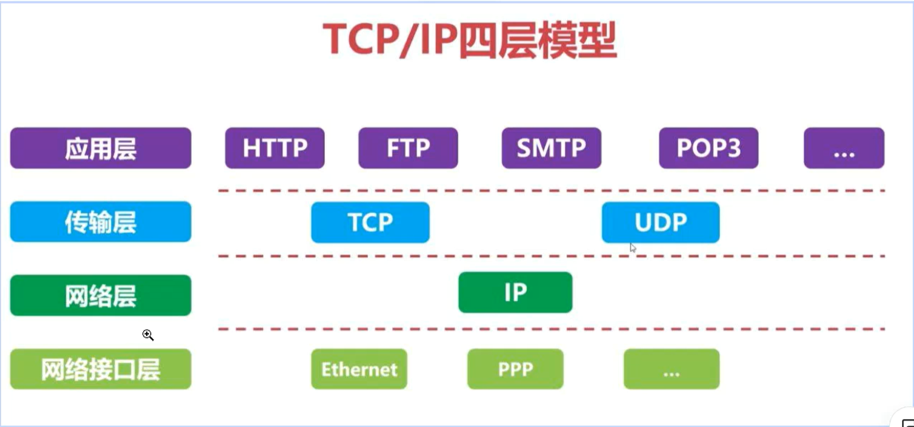
1.应用层：主要负责为用户提供网络应用服务，如HTTP、FTP、DNS等

2.传输层：主要负责在网络中建立端到端的连接，提供可靠的数据传输，如TCP、UDP等

3.网络层：主要负责网络地址的分配和路由器的选择，如IP协议

4.网络接口层：主要负责传输数据帧，如以太网、无线局域网等


#### 特点
可靠性、可扩展性和灵活性
#### 报文结构
eg：
源端口号：49465
目的端口号：443
序列号：1
确认号：2000
数据偏移：5（表示首部长度为20字节）
控制位：ACK，PSH
窗口大小：516
校验和：计算后的校验值
紧急指针：0
数据部分：实际传输的应用层数据
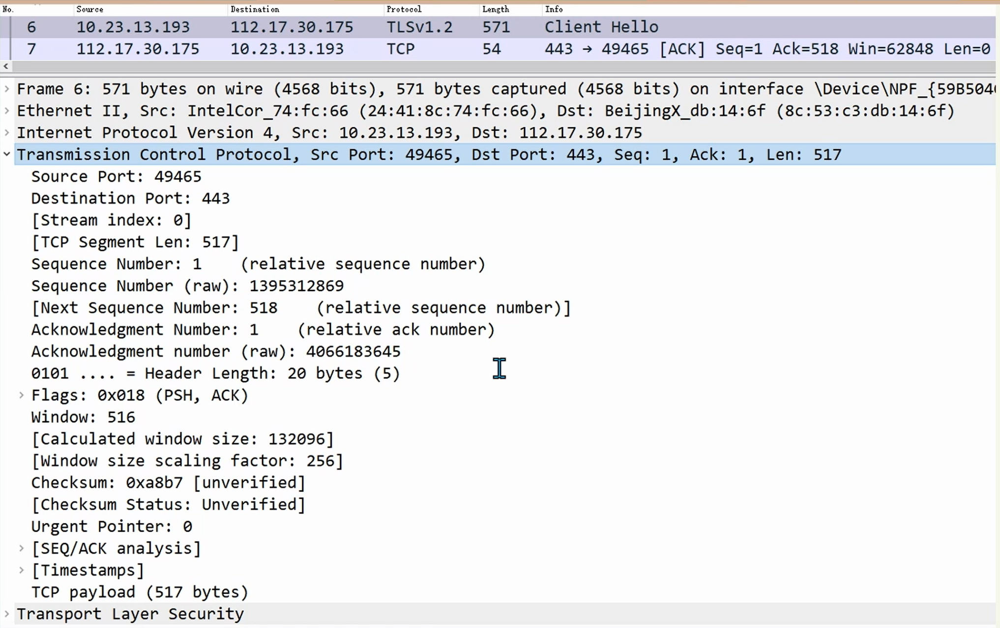
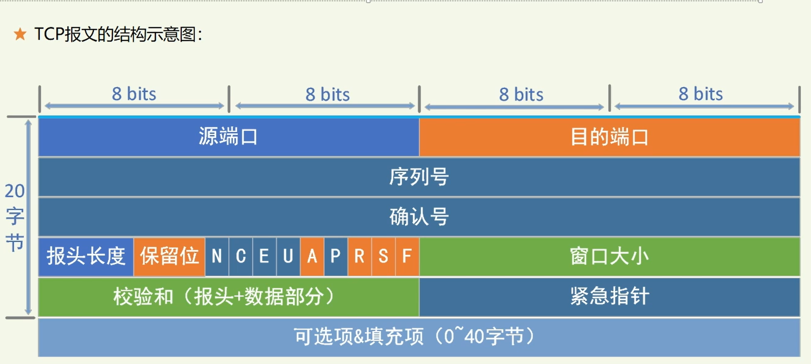
NCEUAPRSF为标志位
#### 建立连接和释放连接的过程
- 建立连接：三次握手（1开启，0关闭。大写的是标志位，小写的是序号和确认号。序号是x，确认号就是x+1）
 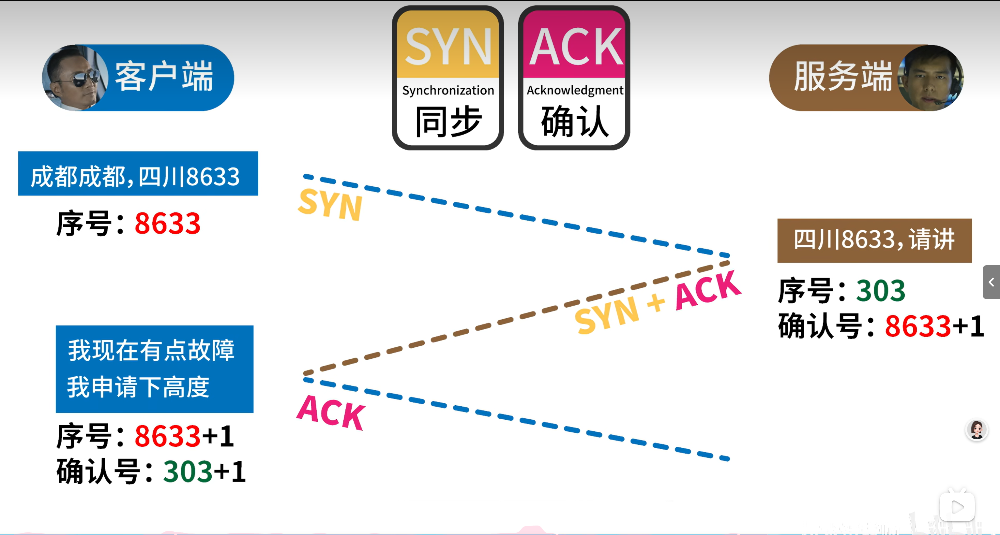
 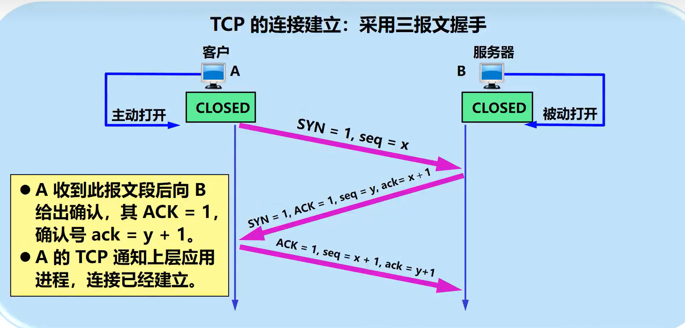
- 释放连接：四次挥手
- 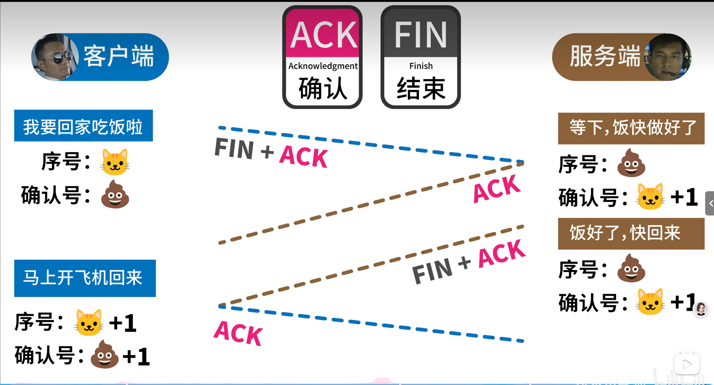
  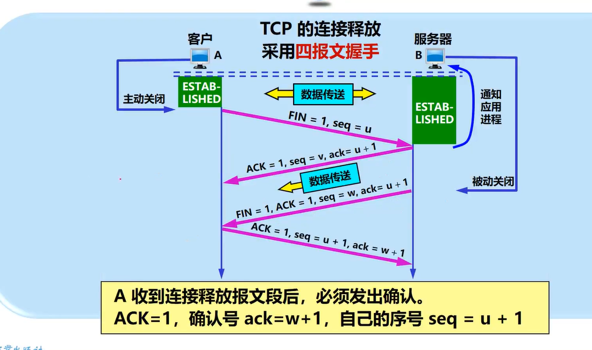


### HTTP
超文本传输协议  Hyper Text Transfer Protocol
#### 报文结构
- http请求：请求行、请求头、请求体
- http响应：响应行、响应头、响应体
  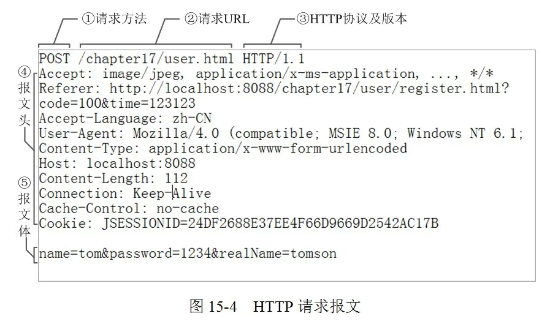
#### 状态码的含义
  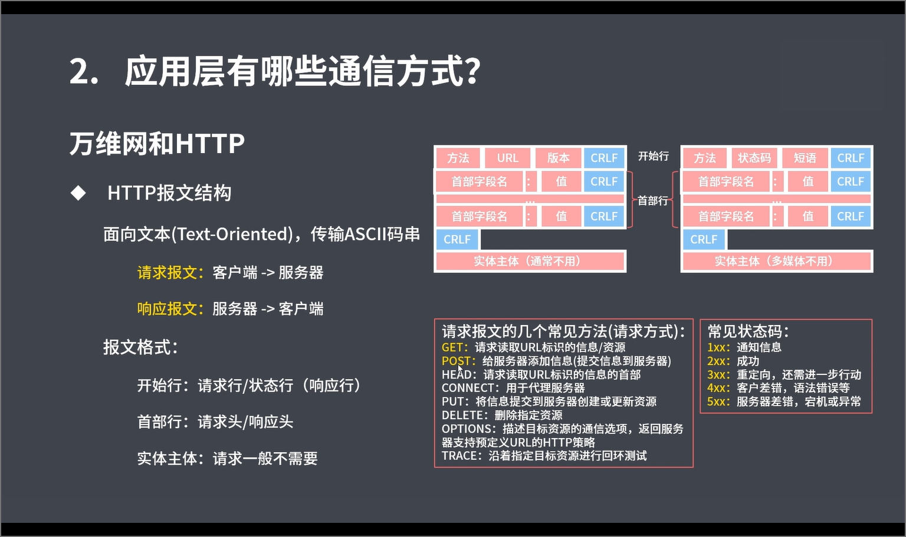
#### 一个完整的HTTP请求/响应过程是什么样
- 1. 客户端请求阶段
  - 1.1 用户输入URL（粗略可看作网址）
  - 1.2 DNS解析：浏览器通过DNS解析将``域名转换为IP地址``
  - 1.3 建立TCP连接：浏览器与目标服务器建立TCP连接（三次握手）
  - 1.4 发送HTTP请求：浏览器通过TCP连接向服务器发送HTTP请求

- 2. 服务器处理阶段
  - 2.1 接收请求：服务器接收客户端的HTTP请求，并解析
  - 2.2 应用层处理：服务器根据请求的URL，查找对应的资源
  - 2.3 构建响应服务器构建HTTP响应
- 3. 客户端接收阶段
  - 3.1 接收响应：浏览器通过TCP连接接收服务器的HTTP响应
  - 3.2 处理响应：解析响应内容
  - 3.3 渲染页面：根据解析的结果渲染页面
  - 3.4 关闭TCP连接：浏览器通过TCP四次挥手关闭连接
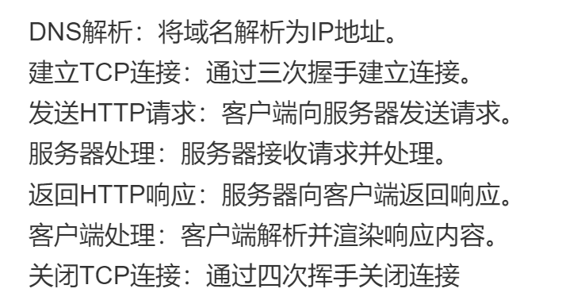


## 实践内容
### 使用Wireshark工具分析网络包
Frame代表物理层的数据包
Ethernet II：以太网数据连接层(可看到源ip和目标ip)
IP:网络层
TCP：传输层
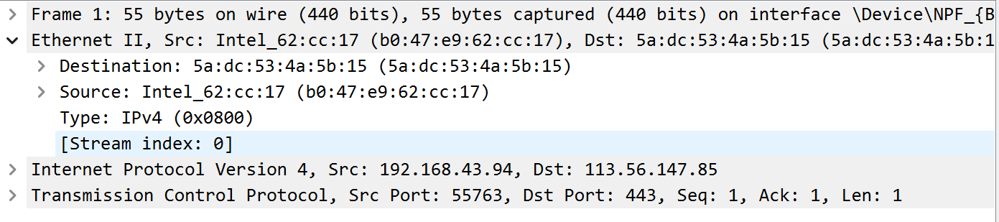

--- 
tcp三次握手、四次挥手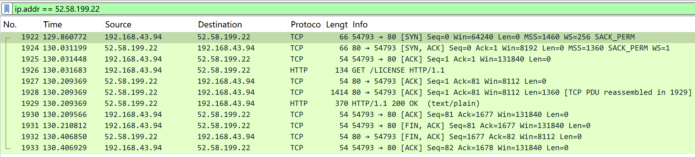前三行：三次握手，最后三行：四次挥手

---
win+r 打开 cmd，输入ping www.baidu.com 回车，查看百度的ip地址，输入curl www.baidu.com 回车，查看百度的网页。
之后便可以用WS并过滤IP地址即可

###  Go 基于 TCP Socket 开发 C/S 架构的 demo（Client/Server架构）
与AI共同完成（自己实在是写不出来，go语言相当不会用）
```go
server.go
package main

import (
    "fmt"
    "net"     //提供相关网络功能
)

func main() {          //启动TCP
    //提示服务器正在启动
    fmt.Println("Starting the server...")
    // 用net.Listen创建监听器
    //监听器主机端口号是8001
    listener, err := net.Listen("tcp", "localhost:8001")
    
    if err != nil {
        fmt.Println("Error listening:", err.Error())
        return
    }
   
   //确保在进程结束前关闭监听器
   defer listener.Close()

    fmt.Println("Listening on localhost:8001")
 
    // 不断接受客户端连接
    for {
       //等待客户端连接。如果有客户端连接，返回一个 net.Conn 对象（表示连接）
        conn, err := listener.Accept()
        //错误处理
        if err != nil {
            fmt.Println("Error accepting:", err.Error())
            continue
        }
        fmt.Println("Client connected:", conn.RemoteAddr().String())

        // 启动一个新的goroutine来处理连接。Goroutine 是 Go 的轻量级线程，允许多个客户端同时连接并处理消息。
        go handleConnection(conn)
    }
}
// heandleConnection 函数用于处理连接。它读取客户端发送的数据，并将其打印到控制台。
func handleConnection(conn net.Conn) {
    
    //确保在函数结束时关闭连接，释放资源
    defer conn.Close()

    // 创建一个缓冲区，用于读取数据
    area := make([]byte, 1024)
    for {
        // 读取客户端发送的数据
        n, err := conn.Read(area)
        if err != nil {
            fmt.Println("Error reading:", err.Error())
            return
        }

        // 打印接收到的数据
        fmt.Printf("Received %s\n", string(buffer))
    }
}
```
```go
client.go
package main

import (
    "bufio"   //用于缓冲输入输出
    "fmt"
    "net"   //用于网络通信
    "os"
    "strings"
)

func main() {
    fmt.Println("Starting the client...")
    // 连接到服务器
    //使用net.Dial函数尝试通过TCP协议连接到本地运行在端口8001上的服务器
    conn, err := net.Dial("tcp", "localhost:8001")
    if err != nil {
        fmt.Println("Error connecting:", err.Error())
        return
    }
    defer conn.Close()
    fmt.Println("Connected to server:", conn.RemoteAddr().String())

    // 用于从标准输入（键盘）读取用户输入
    reader := bufio.NewReader(os.Stdin)

    for {
        fmt.Print("Enter message to send: ")
        // 读取用户输入
        text, _ := reader.ReadString('\n')
        // 去掉换行符
        text = strings.TrimSpace(text)

        // 发送数据到服务器
        _, err := conn.Write([]byte(text))
        if err != nil {
            fmt.Println("Error writing:", err.Error())
            return
        }

        // 如果输入 "exit"，则退出客户端
        if text == "exit" {
            fmt.Println("Exiting client...")
            return
        }
    }
}
```

###  Go 基于 net/http 开发 C/S 架构的 demo
跟上面一样，与ai共同完成（对我来说太难了）
```go
package main

import (
    "fmt"
    "net/http"    //Go 语言标准库中的 HTTP 包，用于创建 HTTP 服务器和客户端
)

// 用于处理客户端请求
//w http.ResponseWriter：用于向客户端写入 HTTP 响应内容
//r *http.Request：表示客户端的 HTTP 请求
func handler(w http.ResponseWriter, r *http.Request) {
    fmt.Fprintf(w, "Hello, World!")
}

func main() {
  //这是 net/http 包提供的一个函数，用于将指定的路径（这里是根路径 /）与处理函数（这里是 handler）绑定
    http.HandleFunc("/", handler)

    fmt.Println("Starting server at port 8080")
    //这是 net/http 包提供的一个函数，用于启动一个 HTTP 服务器并监听指定的地址和端口
    if err := http.ListenAndServe(":8080", nil); err != nil {
        fmt.Println(err)
    }
}
```
## 小结
已经蒙了······

## 参考资料
- TCP/IP ----[飞天闪客](https://www.bilibili.com/video/BV17x6hYZEzJ?vd_source=2552ef659ebde2f6dadff1230dbbb677)
- TCP/IP ----[牛兮兮的书](https://www.bilibili.com/video/BV1jh411r7qV?vd_source=2552ef659ebde2f6dadff1230dbbb677)
- Wireshark ----[技术爬爬虾](https://www.bilibili.com/video/BV12X6gYUEqA?vd_source=2552ef659ebde2f6dadff1230dbbb677)
- go的代码 ----[豆包](https://www.doubao.com/)