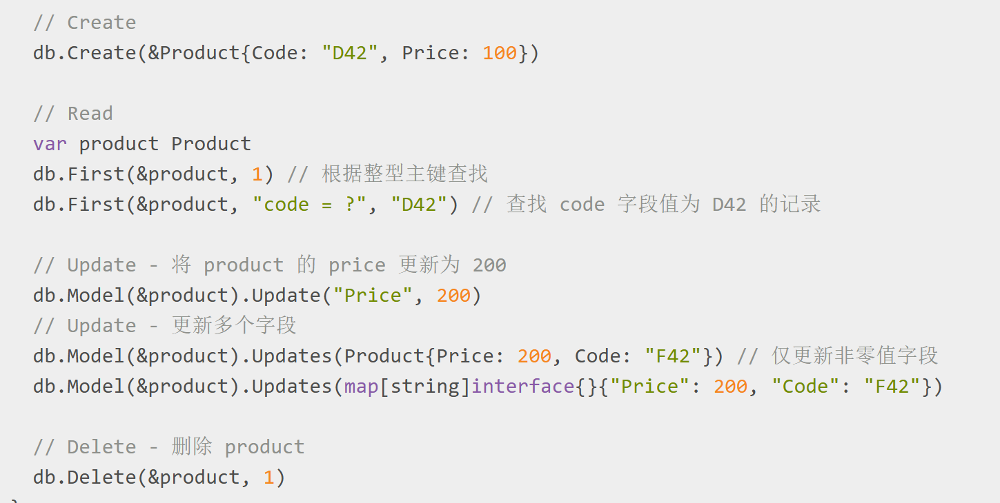

# 后端3.0
> 主要为MySQL、Gorm


## 学习目录
- 1.MySQL
- 2.Gorm

## 学习内容

### MySQL
- 环境搭建：VMware虚拟机搞好了，还在找如何搭建MySQL环境
- 数据表结构: 创建数据表时，需要定义表的结构，包括列的名称、数据类型、约束条件。此语句创建了一个名为users的表，包含id、username、email和created_at四个字段
    
```
      CREATE TABLE users (
    id INT AUTO_INCREMENT PRIMARY KEY,
    username VARCHAR(50) NOT NULL,
    email VARCHAR(100) UNIQUE,
    created_at TIMESTAMP DEFAULT CURRENT_TIMESTAMP
);
```
- 不同表之间如何建立关联
  - 一对一
  - 一对多
  - 多对多
```
 假设有一个用户表 users 和一个用户详细信息表 user_details，每个用户只有一个详细信息记录(1对1)

CREATE TABLE users (
    user_id INT PRIMARY KEY AUTO_INCREMENT,       //user_id: 主键，类型为 INT，并设置为自动递增 (AUTO_INCREMENT)
    username VARCHAR(50) NOT NULL                 //username: 类型为 VARCHAR(50)，且不能为空 (NOT NULL)
);

CREATE TABLE user_details (
    detail_id INT PRIMARY KEY AUTO_INCREMENT,      //detail_id: 主键，类型为 INT，并设置为自动递增
    user_id INT UNIQUE,                            //user_id: 类型为 INT，并且设置了 UNIQUE 约束，表示每个用户在 user_details 表中只能有一条记录。此外，它作为外键，引用了 users 表中的 user_id 列
    address VARCHAR(255),                          //address: 类型为 VARCHAR(255)，用于存储用户的地址信息
    FOREIGN KEY (user_id) REFERENCES users(user_id)

    //FOREIGN KEY (user_id):当前表中的 user_id 列是一个外键。外键是用来引用另一个表中的主键列的字段。
    //REFERENCES users(user_id):当前表中的 user_id 列引用了 users 表中的 user_id 列。users(user_id) 中的 users 是被引用的表名，user_id 是该表中的主键列
);
```   
- SQL 查询语句（CURD）
  - create:用 CREATE TABLE 语句定义表的结构
  - update:用 UPDATE 语句，eg：
UPDATE Employees SET Salary = 6000.00 WHERE ID = 1;
这条语句将 Employees 表中 ID 为 1 的员工的 Salary 更新为 6000.00
  - delete：用 DELETE 语句，eg：
DELETE FROM Employees WHERE ID = 1; 
  - select：用 SELECT 语句，eg：
SELECT * FROM Employees WHERE ID = 1; 

### Gorm
Gorm是一个用Go语言编写的对象关系映射（ORM）库，旨在简化数据库操作和管理。它通过将数据库表映射到面向对象的模型中，使得开发者可以以更简洁、高效的方式进行数据库操作，而无需直接编写复杂的SQL语句
- ORM和Gorm：
  - ORM：ORM（Object-Relational Mapping，对象关系映射）是一种编程技术，旨在将面向对象编程（OOP）中的对象模型与关系型数据库中的表、字段和键等数据结构进行转换和映射，实现对象与数据库表之间的无缝交互，从而简化数据库操作
  - orm作用：简化数据库操作，提高开发效率
  - orm原理：表中对象和数据的映射关系
- 安装和配置Gorm：
- Gorm基础操作：
  - 


## 实践内容
前面已经懵掉了，不知道怎么做，后面搞懂了再补上
## 小结
已经懵掉85%了······

## 参考资料
- MySQL --- [表的结构](https://cloud.tencent.com/developer/information/mysql%E4%B8%AD%E8%A1%A8%E7%9A%84%E7%BB%93%E6%9E%84%E6%98%AF%E4%BB%80%E4%B9%88)
- [GORM 指南](https://gorm.io/zh_CN/docs/index.html)